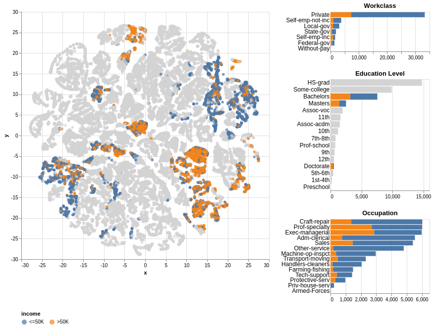

# Categorical_Embedding
Using Word2Vec to create embeddings for categorical features and visualize the dataset.
Also use the categorical embeddings to train a classifier, and compare the results to when using one-hot encoding.

## Software Requirements

This project uses the following software and Python libraries:

- [Python 3.7](https://www.python.org/downloads/release/python-370/)
- [NumPy](http://www.numpy.org/)
- [Pandas](http://pandas.pydata.org/)
- [scikit-learn](http://scikit-learn.org/stable/)
- [Altair](https://altair-viz.github.io/index.html)
- [time](https://docs.python.org/3/library/time.html)
- [gensim](https://radimrehurek.com/gensim/index.html)
- [Jupyter Notebook](http://ipython.org/notebook.html)

## Project Files

- `categorical_embedding.ipynb`: Notebook with code for categorical embeddings calculation and using the embeddings to predict income.
- `categorical_one_hot_encoding.ipynb`: Notebook with code for using one-hot encoding to predict income.
- `census.csv`: The project dataset.

## Results

**Scatter plot with tooltip shown on hover over a data point**

**Data points with Gender 'Female' highlighted in scatter plot**

**Data points with Marital status 'Married-civ-spouse' highlighted in scatter plot**

**Data points with Education Level 'Bachelors', 'Masters', or 'Doctorate' highlighted in scatter plot**

## Acknowledgements

- [UCI Machine Learning Repository](https://archive.ics.uci.edu/ml/datasets/Census+Income)

## Author
[Shahzeb Akhtar](https://www.linkedin.com/in/shahzebakhtar/)
